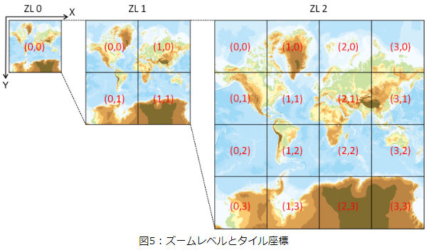

# 緯度、経度をもとに国土地理院タイルを表示する方法(ライブラリ未使用)

## はじめに

[Leaflet](https://leafletjs.com/)など、地図を表示するJavaScriptライブラリを用いると簡単に表示できますが、仕組みを理解するため**あえて**自力で計算してタイルを表示します。

探してみると、計算方法は見つかるのですが、数学が苦手な僕にはちょっと難しい・・・ので、できるだけ分かりやすい式で作りました。

最後に計算結果の確認をするため、富士山山頂の座標(35.36072, 138.72743)をもとに、タイル画像を表示してみます。

  


参考ページ

  * [Zenn:メルカトルとは何かを計算式から見る](https://zenn.dev/boiledorange73/articles/0048-mercator-figure)
  * [Qiita:メルカトル図法](https://qiita.com/Seo-4d696b75/items/aa6adfbfba404fcd65aa)
  * [wikipedia:メルカトル図法](https://ja.wikipedia.org/wiki/%E3%83%A1%E3%83%AB%E3%82%AB%E3%83%88%E3%83%AB%E5%9B%B3%E6%B3%95)

## 国土地理院タイルの特徴

* タイルはメルカトル図法
* 地図画像は縦横256pixcelの正方形
* ズームレベル0は全世界を1枚(256×256)で表示する
  * 緯度85度まで(256pxに収まる範囲。発散してしまうので)
  * 左上を原点とする座標系(西経180度北緯85度)
  * 緯度0経度0が画像の中心になる
* レベル1はそれを縦横2分割(2×2=4枚)、レベル2はさらに2分割(4×4=16枚)
  * レベルが上がるごとに詳細な地図に分割されていく(上限は提供される地図毎に異なる)


* 参考画像

  


## タイルのURL
```
  https://cyberjapandata.gsi.go.jp/xyz/{t}/{z}/{x}/{y}.{ext}
  {t}：データID
  {x}：左上を原点にしたタイルの位置(X)
  {y}：左上を原点にしたタイルの位置(Y)
  {z}：ズームレベル
  {ext}：拡張子
    ex. zoomlevel:6 左上からx方向に57枚目、y方向に23枚目のタイルを取得
    https://cyberjapandata.gsi.go.jp/xyz/std/6/57/23.png
```

* データID

  タイルの種類は[地理院タイル一覧](https://maps.gsi.go.jp/development/ichiran.html)参照

## タイルの計算方法

TypeScriptで書いてありますが、引数の型指定だけしか使っていないのでそこを消せばjavascriptとしても動きます
### 経度

レベル0のタイル(地球一周256px)を元に、zoomlevelをかけて算出する

```typescript
/**
 * 経度から座標(タイルとタイル内pixcel)を計算
 * @param lng 経度
 * @param z zoomlevel
 * @returns
 */
export const calcCoordX = (lng: number, z: number) => {
  // ラジアンに変換
  const lng_rad = (Math.PI / 180) * lng;

  // zoomレベル0の場合、256pxで360度(2PIラジアン)
  //  ⇒ ラジアンあたりpxを計算
  const R = 256 / (2 * Math.PI);

  // グリニッジ子午線を原点とした位置(x) (-128～128)
  let worldCoordX = R * lng_rad;

  // 左端を原点にするために180度分を加算する(0～256)
  worldCoordX = worldCoordX + R * (Math.PI / 180) * 180;

  // 1周256px換算で計算した値にzoomをかけて、zoomで換算した画像の位置を計算
  //  ⇒ https://maps.gsi.go.jp/development/siyou.html#siyou-zm
  const pixelCoordX = worldCoordX * Math.pow(2, z);

  // 1つの画像が256pxなので、256で割って左端からの画像の枚数(タイルの位置)を求める
  // (0オリジンなので切り捨て)
  const tileCoordX = Math.floor(pixelCoordX / 256);

  // 左側のタイル幅合計を引いて、表示タイル内のpx位置を算出する
  const imagePosX = Math.floor(pixelCoordX - tileCoordX * 256);

  // 計算した値を返す
  return {
    worldCoordX,
    pixelCoordX,
    tileCoordX,
    imagePosX,
  };
};
```
### 緯度

* レベル0のタイル(北極～南極が256px)を元に、zoomlevelをかけて算出する

```typescript
/**
 * 緯度から座標(タイルとタイル内pixcel)を計算
 * メルカトル図法で緯度から位置を算出する式 (https://qiita.com/Seo-4d696b75/items/aa6adfbfba404fcd65aa)
 *  R ln(tan(π/4 + ϕ/2))
 *    R: 半径
 *    ϕ: 緯度(ラジアン)
 * @param lat 緯度
 * @param z zoomlevel
 * @returns
 */
export const calcCoordY = (lat: number, z: number) => {
  // ラジアン
  const lat_rad = (Math.PI / 180) * lat;

  // zoomレベル0の場合、256pxで360度(2PIラジアン)
  //  ⇒ ラジアンあたりpxを計算
  const R = 256 / (2 * Math.PI);

  // メルカトル図法で緯度から位置を算出
  let worldCoordY = R * Math.log(Math.tan(Math.PI / 4 + lat_rad / 2));

  // 赤道からの位置(北緯)で計算しているので、左上を原点とするため軸を逆転＋北極側を原点に換算
  worldCoordY = -1 * worldCoordY + 128;

  // 256px換算で計算した値にzoomをかけて、zoomで換算した画像の位置を計算
  const pixelCoordY = worldCoordY * Math.pow(2, z);

  // 1つの画像が256pxなので、256で割って左端からの画像の枚数(位置)を求める
  // 0オリジンなので切り捨て
  const tileCoordY = Math.floor(pixelCoordY / 256);

  // 上側のタイル幅合計を引いて、表示タイル内のpx位置を算出する
  const imagePosY = Math.floor(pixelCoordY - tileCoordY * 256);

  // 計算した値を返す
  return {
    worldCoordY,
    pixelCoordY,
    tileCoordY,
    imagePosY,
  };
};
```


### 上記を元にタイルの位置を求める

* データID(地図の種類): std
* zoomlevel: 10

富士山山頂の座標(35.36072, 138.72743)を入れて計算

|   | 座標 | タイル | タイル内座標 |
| ---- | :---: | ---: |  ---: |
|  経度  |  138.72743  | 906 | 154 |
|  緯度  |  35.36072  | 404 | 89 |

計算よりURLは下記の通りとなり、タイル画像には富士山が表示されました
* https://cyberjapandata.gsi.go.jp/xyz/std/10/906/404.png

  


## 標高の取得

### 標高タイルについて

標高タイルは画素の色情報から、標高を計算できる特別なタイルです。

* https://cyberjapandata.gsi.go.jp/xyz/dem5a_png/10/906/404.png
  

`dem5a`は0.3m以内という高い精度を持ちますが、データが存在しない場合があります(富士山右上の茶色の部分)


* 仕様について[標高タイルのデータ仕様](https://maps.gsi.go.jp/development/demtile.html)から引用
```
24ビットカラーのPNG形式で、一つのタイルの大きさは256ピクセル×256ピクセルです。テキスト形式の標高タイルより、データサイズが小さいという特徴があります。
ピクセルの画素値（RGB値）から、当該ピクセル座標の標高値が算出できます。
画素値（RGB値）から算出される標高値は、テキスト形式の標高タイルの標高値と同じになります。
画素値（RGB値）から標高値h（m）の計算式は下記のとおりです。

x = 2^16R + 2^8G + B
x < 2^23の場合　h = xu
x = 2^23の場合　h = NA
x > 2^23の場合　h = (x-2^24)u
uは標高分解能（0.01m）を表します。また、無効値（標高タイル（テキスト形式）の「e」に該当する箇所）は(R, G, B)=(128, 0, 0)です。
```
* `^`は累乗

### 標高の取得手順

まず、上記で作成した関数をもとに、タイルの座標計算と、画像を読み込むユーティリティー関数を作成します

```typescript
/**
 * 指定位置に該当するタイル位置と、該当タイル内の位置を返す
 * @param lat 緯度
 * @param lng 経度
 * @param z zoomlevel
 * @returns
 */
export const calcTileInfo = (lat: number, lng: number, z: number) => {
  // (x, y): 指定位置に該当するタイル位置
  // (pX, pY): 該当タイル内の位置
  const coordX = calcCoordX(lng, z);
  const coordY = calcCoordY(lat, z);
  return {
    x: coordX.tileCoordX,
    y: coordY.tileCoordY,
    pX: coordX.imagePosX,
    pY: coordY.imagePosY,
    z,
  };
};


/**
 * タイルを読み込みHTMLImageElementを返す
 *
 * @param x
 * @param y
 * @param z
 * @param option
 * @returns
 */
export const loadTile = (
  x: number,
  y: number,
  z: number,
  option: { dataType: string; ext?: string }
) => {
  const { dataType, ext } = option;

  const url = `https://cyberjapandata.gsi.go.jp/xyz/${dataType}/${z}/${x}/${y}.${
    ext ?? 'png'
  }`;
  const img = new Image();
  img.setAttribute('crossorigin', 'anonymous');
  img.src = url;
  return img;
};
```

* dem5aから標高を取得

次に、標高タイルを読み込み、指定座標から標高を計算して返す関数を作成します

1. `calcTileInfo()`でタイルとタイル内の座標を計算する
1. `loadTile()`でタイルを読み込む&lt;img&gt;タグを準備する
1. タイルを描画するcanvasを作成する(描画後に色を取得するため)
1. `img.onloadイベント`で読み込んだ画像から、該当位置の色情報を取得し、標高に換算する

```typescript
/**
 * dem5aから標高を取得
 * @param lat
 * @param lng
 */
export const getElevation = async (
  lat: number,
  lng: number
): Promise<number> => {
  const z = 15;

  // 描画用のCanvasを用意する
  const canvas = document.createElement('canvas');
  [canvas.width, canvas.height] = [256, 256];
  const ctx = canvas.getContext('2d', { willReadFrequently: true });

  // タイルを取得
  const { x, y, pX, pY } = calcTileInfo(lat, lng, z);
  // タイルを読み込むタグを作成
  const img = loadTile(x, y, z, { dataType: 'dem5a_png' });

  // onloadは非同期で発生するため、Promise()でラップして返す
  return new Promise((resolve, reject) => {
    img.onload = () => {
      ctx.drawImage(img, 0, 0);
      // ピクセルカラー配列を取得
      const { data } = ctx.getImageData(0, 0, 256, 256);
      // 1pxあたり4Byte(RGBA)
      const idx = pY * 256 * 4 + pX * 4;
      const r = data[idx + 0];
      const g = data[idx + 1];
      const b = data[idx + 2];

      // 標高に換算
      let h: number | undefined = undefined;
      const resolution = 0.01; // 分解能

      // 定義に従い計算
      // x = 2^16R + 2^8G + B
      // x < 2^23の場合　h = xu
      // x = 2^23の場合　h = NA
      // x > 2^23の場合　h = (x-2^24)u
      // uは標高分解能（0.01m）
      const x = r * 2 ** 16 + g * 2 ** 8 + b;
      if (x < 2 ** 23) {
        h = x * resolution;
      } else if (x == 2 ** 23) {
        h = undefined;
      } else if (x > 2 ** 23) {
        h = x - 2 ** 24 * resolution;
      }

      resolve(h);
    };
  });
};

```
